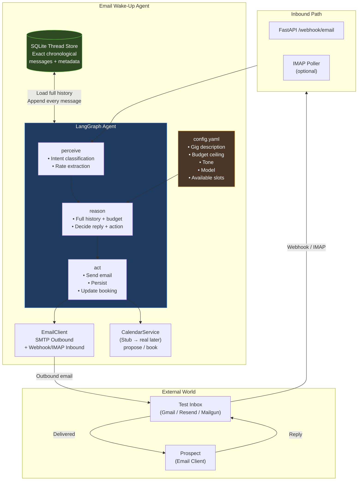
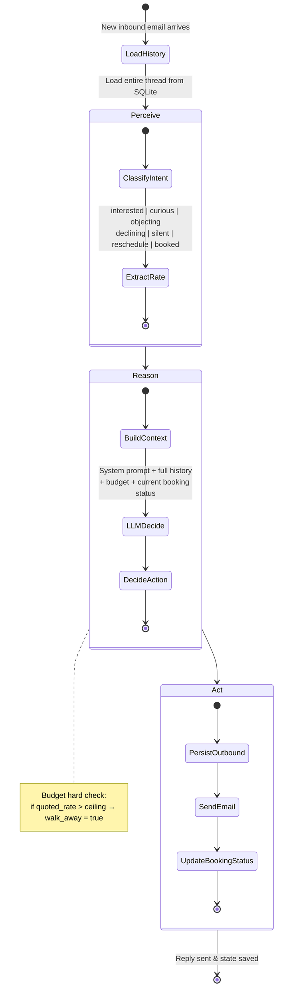
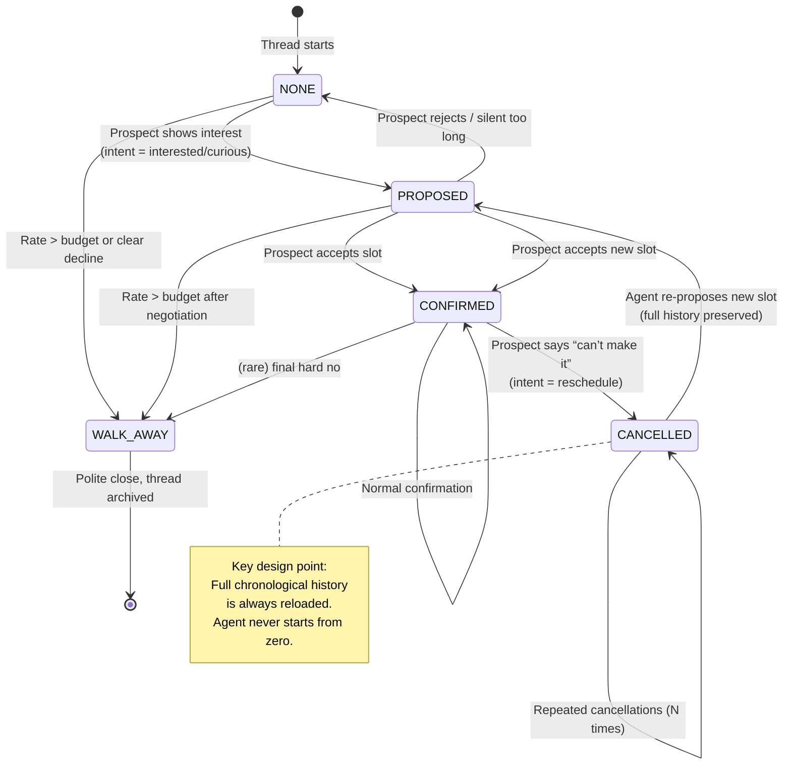

# Email Wake-up Agent
An autonomous Email Wake-Up Agent with following capabilities.
 

- Starts and continues email conversations with prospects about a contract/gig opportunity.

- Primary goal: get the prospect to book a call.

- Must negotiate rates within a hard budget ceiling, handle objections, and never lose context.
-  Critically must handle the reschedule loop cleanly any number of times (prospect books → later cancels → agent re-opens negotiation and books a new slot while remembering everything.  


## High-Level System Architecture




## LangGraph Agent Loop (Perception → Reasoning → Action)



## Booking / Reschedule State Machine (Critical Path)




## How to run the project:

cd email-wakeup-agent

python -m venv .venv && source .venv/bin/activate

pip install -r requirements.txt

## Start Ollama (required for real LLM replies)

ollama pull llama3.1:8b

ollama serve

## API
uv run uvicorn app.main:app --reload --port 8000

## Generate the three required transcripts
python -m scripts.demo_transcripts


### Test :

Here’s a clean, step-by-step guide to test a **full successful cycle** from the Swagger UI.

---

### Prerequisites

1. Make sure the server is running:

```bash
uv run uvicorn app.main:app --reload --port 8000
```

2. Open Swagger UI in the browser:

```
http://127.0.0.1:8000/docs
```

3. (Recommended) Have Ollama running with the model:

```bash
ollama serve
ollama pull llama3.1:8b
```

If Ollama is not running you will still get replies, but they will be the fallback “technical hiccup” message.

---

### Full Cycle – Successful Negotiation + Booking

We will use thread ID `demo-001`.

#### Step 1 – Start outreach (`POST /start`)

1. Expand **`POST /start`**
2. Click **Try it out**
3. Paste this body:

```json
{
  "thread_id": "demo-001",
  "prospect_email": "jane.doe@example.com",
  "prospect_name": "Jane Doe"
}
```

4. Click **Execute**

**Expected response (200):**
```json
{
  "thread_id": "demo-001",
  "status": "outreach_sent",
  "reply": "Hi Jane, ... (opening email about the gig)"
}
```

---

#### Step 2 – Prospect shows interest (`POST /webhook/email`)

1. Expand **`POST /webhook/email`**
2. Click **Try it out**
3. Paste:

```json
{
  "thread_id": "demo-001",
  "from_email": "jane.doe@example.com",
  "subject": "Re: Senior Full-Stack Engineer (Remote)",
  "body": "Hi Alex, thanks for reaching out. The role sounds interesting. What’s the rate range and are there any slots next week?"
}
```

4. Click **Execute**

**Expected response:**
- `intent`: `"interested"` or `"curious"`
- `booking_status`: `"PROPOSED"`
- `reply`: agent proposes 2-3 time slots and stays within budget

---

#### Step 3 – Prospect accepts a slot (`POST /webhook/email` again)

Use the **same** endpoint with a new body:

```json
{
  "thread_id": "demo-001",
  "from_email": "jane.doe@example.com",
  "subject": "Re: Senior Full-Stack Engineer (Remote)",
  "body": "The Tuesday 10:00-10:30 UTC slot works perfectly for me. Let’s lock it in. My rate is $80/hr."
}
```

**Expected response:**
- `intent`: `"booked"` (or `"interested"`)
- `booking_status`: `"CONFIRMED"`
- `confirmed_slot`: one of the slots
- `reply`: confirmation message

---

#### Step 4 – Inspect the full conversation (`GET /thread/{thread_id}`)

1. Expand **`GET /thread/{thread_id}`**
2. Enter `demo-001` in the path parameter
3. Click **Execute**

You will see the complete history + current metadata (`booking_status`, `confirmed_slot`, etc.).

---

### Bonus – Quick tests for the other two required scenarios

**A. Reschedule loop**

After the call is confirmed, send:

```json
{
  "thread_id": "demo-001",
  "from_email": "jane.doe@example.com",
  "subject": "Re: ...",
  "body": "Hey Alex, something came up and I can’t make the Tuesday slot anymore. Really sorry – can we find another time?"
}
```

Then accept a new slot in the next message.  
`booking_status` should go `CONFIRMED → CANCELLED → PROPOSED → CONFIRMED`.

**B. Walk-away (over budget)**

Start a new thread (`demo-002`) and reply with:

```json
{
  "thread_id": "demo-002",
  "from_email": "highrate@example.com",
  "subject": "Re: ...",
  "body": "Thanks for the note. I’m interested but my rate is $120/hr."
}
```

You should see `walk_away: true` and a polite closing message.

---

### Quick reference – Sample payloads

| Step | Endpoint | Sample `thread_id` | Key field in body |
|------|----------|--------------------|-------------------|
| 1. Start | `POST /start` | `demo-001` | `prospect_email` |
| 2. Interest | `POST /webhook/email` | `demo-001` | `body` with interest |
| 3. Accept | `POST /webhook/email` | `demo-001` | `body` accepting a slot + rate ≤ $85 |
| 4. Inspect | `GET /thread/demo-001` | – | – |

That’s a complete, working end-to-end cycle you can demo in under 2 minutes from Swagger.