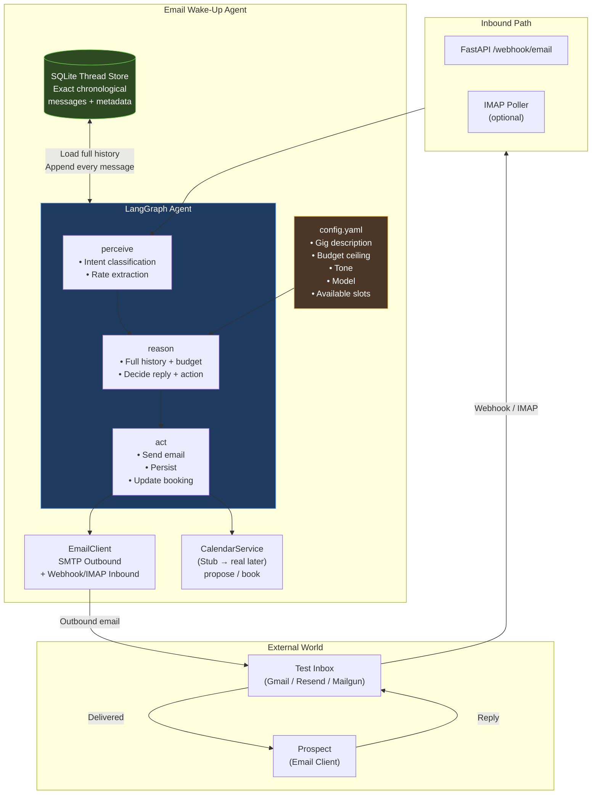
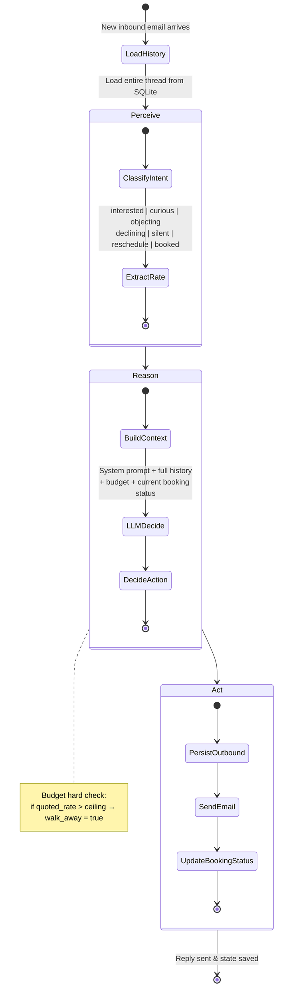
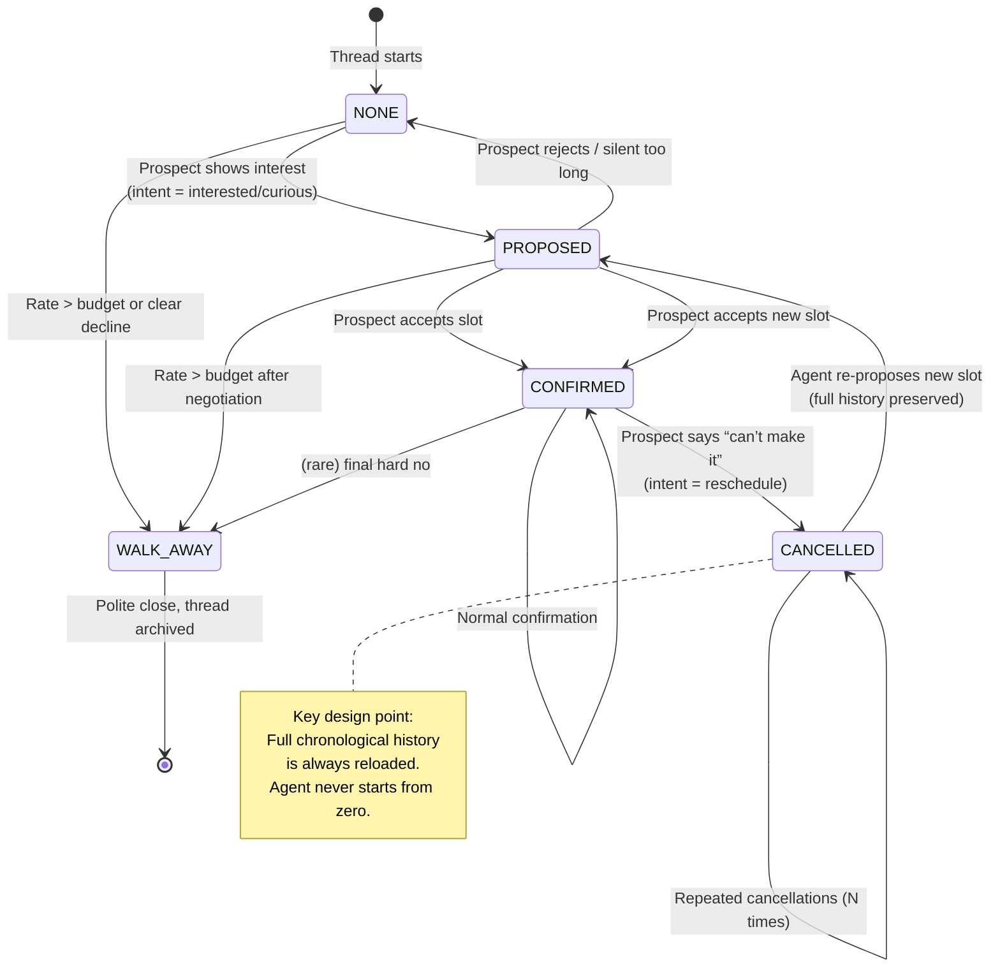

# Email Wake-up Agent
An autonomous Email Wake-Up Agent with following capabilities.
 

- Starts and continues email conversations with prospects about a contract/gig opportunity.

- Primary goal: get the prospect to book a call.

- Must negotiate rates within a hard budget ceiling, handle objections, and never lose context.
-  Critically must handle the reschedule loop cleanly any number of times (prospect books → later cancels → agent re-opens negotiation and books a new slot while remembering everything.  

## High-Level System Architecture

## LangGraph Agent Loop (Perception → Reasoning → Action)

## Booking / Reschedule State Machine (Critical Path)

How to run the project:

cd email-wakeup-agent
python -m venv .venv && source .venv/bin/activate
pip install -r requirements.txt

# Start Ollama (required for real LLM replies)
ollama pull llama3.1:8b
ollama serve

# API
uv run uvicorn app.main:app --reload --port 8000

# Generate the three required transcripts
python -m scripts.demo_transcripts